# 2. Constraints

## 2.1 Constraint between Two Nodes

For the following examples we define two nodes and a helper constant.

```js
const pi = Math.PI;
const A = {x:0,y:0,label:'A'};
const B = {x:80,y:40,label:'B'};
```
The blue lines in the examples are not implicitly generated by the constraints. They were added by the underlying graphics system.

<br>
<aside>
  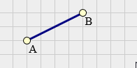
</aside>

Two Unconstrained Nodes

```js
cstr().n2({ n1:A,n2:B })
```
<br>
<aside>
  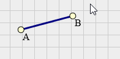
</aside>

Angular Constraint
```js
cstr().n2({ n1:A,n2:B,
            ang:pi/12 })  // 15° 
```
<br>
<aside>
  
</aside>

Length Constraint
```js
cstr().n2({ n1:A,n2:B,
            len:80 })
```

<br>
<aside>
  
</aside>

Length + Angular Constraint
```js
cstr().n2({ n1:A,n2:B,
            ang:pi/12, // 15° 
            len:80 })
```
<br>
<aside>
  
</aside>

Length Limits
```js
cstr().n2({ n1:A,n2:B,
            len:cstr.len.range(20,120) })
```
<br>
<aside>
  
</aside>

Angular Limits
```js
cstr().n2({ n1:A,n2:B,
            len:cstr.ang.range(0,pi/2) })
```

## 2.2 Constraints between Three Nodes

For the following examples we define three nodes and a helper constant. Some examples use modified coordinates.

```js
const pi = Math.PI;
const A = {x:0,y:0,label:'A'};
const B = {x:60,y:20,label:'B'};
const C = {x:80,y:40,label:'C'};
```

<br>
<aside>
  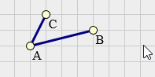
</aside>

Two Length Constraints

```js
cstr().n2({n1:A,n2:B,len:'const'})
      .n2({n1:A,n2:C,len:'const'})
```
<aside>
  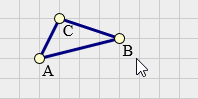
</aside>

Three Length Constraints

```js
cstr().n2({n1:A,n2:B,len:'const'})
      .n2({n1:B,n2:C,len:'const'})
      .n2({n1:A,n2:C,len:'const'})
```
<aside>
  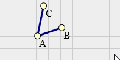
</aside>

Included Angle

```js
cstr().n2({id:'AB',n1:A,n2:B,ang:'const'})
      .n2({n1:A,n2:C,           
           ang:cstr.ang.from('AB',pi/3)})
```
<aside>
  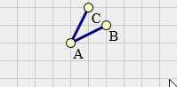
</aside>

Restrict to positive Angle

```js
cstr().n2({id:'AB',n1:A,n2:B,ang:'const'})
      .n2({n1:A,n2:C,           
           ang:cstr.ang.posFrom('AB')})
```

<aside>
  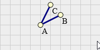
</aside>

Restrict to acute Angle

```js
cstr().n2({id:'AB',n1:A,n2:B,ang:'const'})
      .n2({n1:A,n2:C,           
           ang:cstr.ang.acuteFrom('AB')})
```

<aside>
  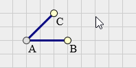
</aside>

Included Angle-Range

```js
cstr().n2({id:'AB',n1:A,n2:B,len:'const'})
  .n2({n1:A,n2:C,
       ang:cstr.ang.inclRange('AB',pi/6,pi/2)})
```

Collinear Nodes
<aside>
  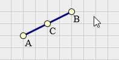
</aside>

```js
cstr().n2({id:'AB',n1:A,n2:B})
      .n2({n1:A,n2:C,
           ang:cstr.ang.from('AB')})
```

Center of Line
<aside>
  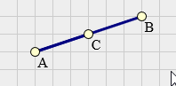
</aside>

```js
cstr().n2({id:'AB',n1:A,n2:B})
      .n2({n1:A,n2:C,
           len:cstr.len.from('AB',1/2),
           ang:cstr.ang.from('AB')})
```

## 2.3 Constraints between Four Nodes

For the following examples we define four nodes and a helper constant. Some examples use modified coordinates.

```js
const pi = Math.PI;
const A = {x:0,y:0,label:'A'};
const B = {x:80,y:20,label:'B'};
const C = {x:20,y:30,label:'C'};
const D = {x:100,y:40,label:'D'};
```

<br>
<aside>
  
</aside>

Two parallel lines

```js
cstr().n2({id:'AB',n1:A,n2:B})
      .n2({n1:C,n2:D,ang:cstr.ang.from('AB')})
```

<br>
<aside>
  
</aside>

Two parallel lines of equal length

```js
cstr().n2({id:'AB',n1:A,n2:B})
      .n2({n1:C,n2:D,len:cstr.len.from('AB'),
                     ang:cstr.ang.from('AB')})
```

<br>
<aside>
  
</aside>

Two orthogonal lines

```js
cstr().n2({id:'AB',n1:A,n2:B})
      .n2({n1:C,n2:D,ang:cstr.ang.from('AB',pi/2)})
```

<br>
<aside>
  
</aside>

Perpendicular bisector of a line

```js
cstr().n2({id:'AB',n1:A,n2:B})
      .n2({n1:A,n2:C,len:cstr.len.from('AB'),
                     ang:cstr.ang.from('AB')})
      .n2({n1:C,n2:D,ang:cstr.ang.from('AB',pi/2)})
```

<br>
<aside>
  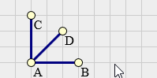
</aside>

Angular bisector of a line

```js
cstr().n2({id:'AB',n1:A,n2:B})
      .n2({id:'AC',n1:A,n2:C})
      .n2({n1:A,n2:D,ang:cstr.ang.delta('AB','AC',1/2)})

```

## 2.4 Simple Constructions

<br>
<aside>
  
</aside>

Intersection of two lines

```js
cstr().n2({id:'AB',n1:A,n2:B})
      .n2({id:'CD',n1:C,n2:D})
      .n2({n1:A,n2:I,ang:cstr.ang.from('AB')})
      .n2({n1:C,n2:I,ang:cstr.ang.from('CD')})
```

<br>
<aside>
  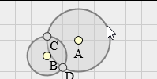
</aside>

Intersection of two circles

```js
cstr().n2({id:'AB',n1:A,n2:B})
      .n2({n1:A,n2:C,len:c1.r,ang:cstr.ang.negFrom('AB')})
      .n2({n1:A,n2:D,len:c1.r,ang:cstr.ang.posFrom('AB')})
      .n2({n1:B,n2:C,len:c2.r,ang:cstr.ang.negFrom('AB')})
      .n2({n1:B,n2:D,len:c2.r,ang:cstr.ang.posFrom('AB')})
```

<br>
<aside>
  
</aside>

Intersection line / circle

```js
cstr().n2({id:'AB',n1:A,n2:B})
      .n2({id:'CM',n1:C,n2:M,len:cir.r,
           ang:cstr.ang.acuteFrom('AB')})
      .n2({id:'DM',n1:D,n2:M,len:cir.r,
           ang:cstr.ang.obtuseFrom('AB')})
      .n2({id:'AC',n1:A,n2:C,ang:cstr.ang.from('AB')})
      .n2({id:'BD',n1:B,n2:D,ang:cstr.ang.from('AB')})
```

<br>
<aside>
  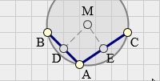
</aside>

Circle by three points

```js
cstr().n2({id:'AB',n1:A,n2:B})
      .n2({id:'BC',n1:B,n2:C})
      .n2({n1:A,n2:D,len:cstr.len.from('AB',1/2),
           ang:cstr.ang.from('AB'),dir:1})
      .n2({n1:B,n2:E,len:cstr.len.from('BC',1/2),
           ang:cstr.ang.from('BC'),dir:1})
      .n2({n1:D,n2:M,ang:cstr.ang.from('AB',pi/2)})
      .n2({n1:E,n2:M,ang:cstr.ang.from('BC',pi/2)})
```

## 2.5 Single Loop Linkages

<br>
<aside>
  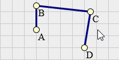
</aside>

RRRR (four-bar)

```js
cstr().n2({n1:A,n2:B,len:'const'})
      .n2({n1:B,n2:C,len:'const'})
      .n2({n1:C,n2:D,len:'const'})
```

<br>
<aside>
  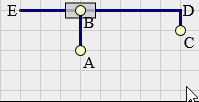
</aside>

RRRP (inverted slider-crank)

```js
cstr().n2({n1:A,n2:B,len:'const'})
      .n2({id:'DB',n1:D,n2:B})
      .n2({id:'DE',n1:D,n2:E,len:'const',
           ang:cstr.ang.from('DB')})
      .n2({n1:C,n2:D,len:'const',
           ang:cstr.ang.from('DE',pi/2)})
```

<br>
<aside>
  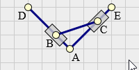
</aside>

RRPP (double-slider)

```js
cstr().n2({id:'AE',n1:A,n2:E,len:'const'})
      .n2({id:'AD',n1:A,n2:D,len:'const'})
      .n2({n1:A,n2:B,ang:cstr.ang.from('AD')})
      .n2({n1:A,n2:C,ang:cstr.ang.from('AE')})
      .n2({n1:B,n2:C,len:'const'})
```

<br>
<aside>
  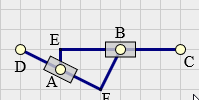
</aside>

RPRP (double-slider)

```js
cstr().n2({id:'EC',n1:E,n2:C,len:'const'})
      .n2({id:'DF',n1:D,n2:F,len:'const'})
      .n2({n1:E,n2:A,len:'const',
           ang:cstr.ang.from('EC',pi/2)})
      .n2({n1:F,n2:B,len:'const',
           ang:cstr.ang.from('DF',pi/2)})
      .n2({n1:C,n2:B,ang:cstr.ang.from('EC')})
      .n2({n1:D,n2:A,ang:cstr.ang.from('DF')})
```
